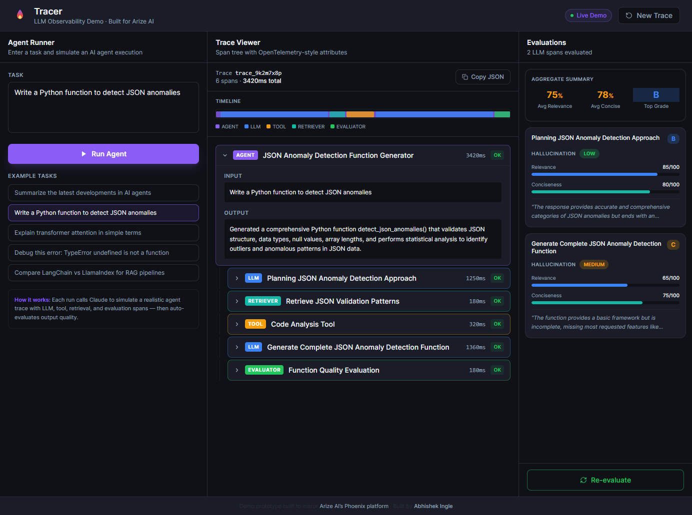

# Tracer

A lightweight LLM observability demo inspired by [Arize AI's Phoenix](https://phoenix.arize.com) platform. Built with Next.js and the Anthropic SDK.

Tracer simulates an AI agent running a task, visualizes the execution as an OpenTelemetry-style span tree, and automatically evaluates each LLM span for hallucination risk, relevance, and conciseness.



---

## Features

- **Agent Runner** — enter any task and run a simulated multi-step AI agent
- **Trace Viewer** — see the full span tree (AGENT → LLM → TOOL → RETRIEVER → EVALUATOR) with timing, token counts, and attributes
- **Eval Panel** — automatic per-span evaluation scoring hallucination (LOW/MEDIUM/HIGH), relevance, conciseness, and an overall letter grade
- **Deterministic evals** — evaluations use `temperature: 0` so scores are stable for the same trace

---

## Tech Stack

- [Next.js 14](https://nextjs.org) (App Router)
- [Anthropic SDK](https://github.com/anthropics/anthropic-sdk-python) — Claude Sonnet for trace generation and evaluation
- [Tailwind CSS](https://tailwindcss.com)
- [Lucide React](https://lucide.dev) for icons

---

## Getting Started

1. **Clone the repo**

```bash
git clone <repo-url>
cd tracer
```

2. **Install dependencies**

```bash
npm install
```

3. **Add your Anthropic API key**

Create a `.env.local` file in the root:

```
ANTHROPIC_API_KEY=sk-ant-...
```

4. **Run the dev server**

```bash
npm run dev
```

Open [http://localhost:3000](http://localhost:3000).

---

## Example Tasks to Try

- `Search for the top causes of sleep deprivation and summarize findings with actionable advice`
- `Explain how RAG works and compare dense vs sparse retrieval`
- `Write a Python function for compound interest and show example outputs`
- `Plan a 3-day Tokyo itinerary using separate agents for attractions, food, and scheduling`

---

## Future Work

- **Real agent execution** — replace simulated traces with actual tool-calling agents (web search, code execution, file I/O) and capture live OpenTelemetry spans
- **Trace history** — persist traces to a database (SQLite or Postgres) so you can browse and compare past runs
- **Side-by-side comparison** — run the same task twice and diff the traces and eval scores
- **Custom eval templates** — let users define their own evaluation rubrics (e.g. tone, safety, brand compliance) beyond the default hallucination/relevance/conciseness
- **Span filtering and search** — filter the trace viewer by span kind, status, or duration threshold
- **Export** — download traces as JSON or OpenTelemetry OTLP format for import into other observability tools
- **Streaming** — stream span nodes into the trace viewer in real time as the agent runs instead of loading all at once
- **Multi-model evals** — run the same evaluation prompt across different models and compare scores

---

## Project Structure

```
src/
├── app/
│   ├── api/
│   │   ├── run-agent/   # generates simulated trace via Claude
│   │   └── evaluate/    # scores each LLM span
│   └── page.tsx         # main layout and state
├── components/
│   ├── AgentRunner.tsx  # task input + loading steps
│   ├── TraceViewer.tsx  # span tree
│   ├── EvalPanel.tsx    # evaluation scores
│   ├── SpanNode.tsx     # individual span row
│   ├── LoadingSteps.tsx # progress indicator
│   └── TopNav.tsx       # header
└── lib/
    ├── anthropic.ts     # Claude API calls
    └── types.ts         # Trace, Span, SpanEval types
```

---

Built by [Abhishek Ingle](https://github.com/abhishekingle662) · Demo prototype mirroring Arize AI's Phoenix platform
